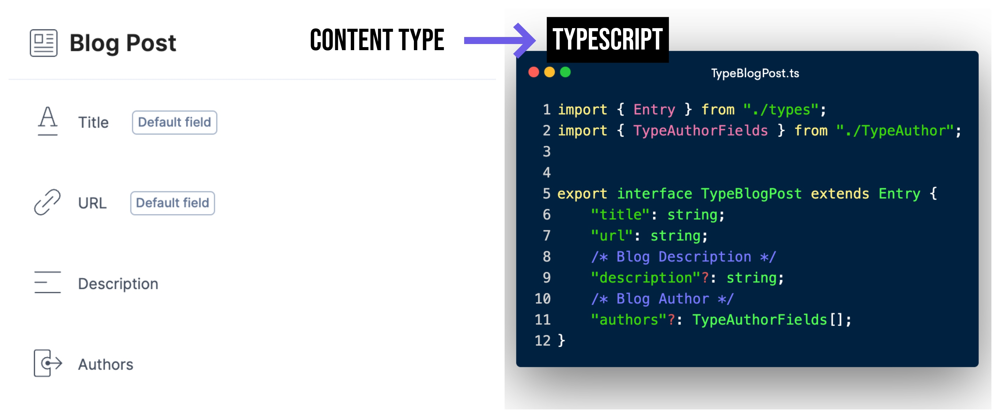

## Contentstack Types Generator


### 1. Install
```
npm i --save-dev contentstack-types-generator
```

### 2. Usage
```
types-generator -a <api_key> -t <delivery_token> -e <environment> -o <output_dir>
```

Above command will generate typescript types file for all the content types in your stack.

---

Below is CLI options

```cmd
Usage: types-generator [options]

CLI tool to generate types for contentstack entries.

Options:
  -a, --apiKey <api_key>           Stack API Key
  -t, --token <delivery_token>     Delivery Token
  -e, --environment <environment>  Environment
  -r, --region <region>            Region (na, eu)
  -o, --output <output_dir>        Output Directory
```